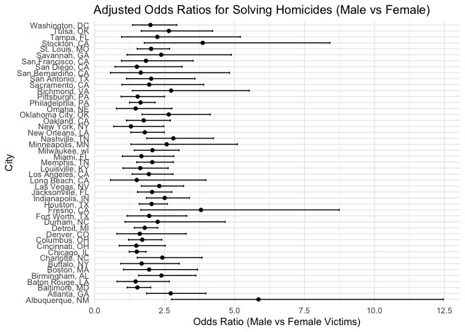

p8105_hw6_zl3544
================
2024-12-02

``` r
library(tidyverse)
```

    ## ── Attaching core tidyverse packages ──────────────────────── tidyverse 2.0.0 ──
    ## ✔ dplyr     1.1.4     ✔ readr     2.1.5
    ## ✔ forcats   1.0.0     ✔ stringr   1.5.1
    ## ✔ ggplot2   3.5.1     ✔ tibble    3.2.1
    ## ✔ lubridate 1.9.3     ✔ tidyr     1.3.1
    ## ✔ purrr     1.0.2     
    ## ── Conflicts ────────────────────────────────────────── tidyverse_conflicts() ──
    ## ✖ dplyr::filter() masks stats::filter()
    ## ✖ dplyr::lag()    masks stats::lag()
    ## ℹ Use the conflicted package (<http://conflicted.r-lib.org/>) to force all conflicts to become errors

``` r
library(purrr)
library(broom)
library(modelr)
```

    ## 
    ## Attaching package: 'modelr'
    ## 
    ## The following object is masked from 'package:broom':
    ## 
    ##     bootstrap

``` r
library(ggplot2)
library(janitor)
```

    ## 
    ## Attaching package: 'janitor'
    ## 
    ## The following objects are masked from 'package:stats':
    ## 
    ##     chisq.test, fisher.test

``` r
library(knitr)
library(forcats)
```

# Problem 2

``` r
# Load and clean the data
homicides <- read_csv('./homicide-data.csv', na = c("Unknown", "NA", "", ".")) %>%
  janitor::clean_names() %>%
  mutate(
    city_state = paste(city, state, sep = ", "),
    resolved = if_else(disposition %in% c('Closed without arrest', 'Open/No arrest'), 0, 1),
    victim_age = as.numeric(victim_age)
  ) %>%
  filter(
    !city_state %in% c("Dallas, TX", "Phoenix, AZ", "Kansas City, MO", "Tulsa, AL"),
    victim_race %in% c("White", "Black")
  ) %>%
  drop_na(victim_age)
```

    ## Rows: 52179 Columns: 12
    ## ── Column specification ────────────────────────────────────────────────────────
    ## Delimiter: ","
    ## chr (8): uid, victim_last, victim_first, victim_race, victim_sex, city, stat...
    ## dbl (4): reported_date, victim_age, lat, lon
    ## 
    ## ℹ Use `spec()` to retrieve the full column specification for this data.
    ## ℹ Specify the column types or set `show_col_types = FALSE` to quiet this message.

``` r
# Logistic regression for Baltimore, MD
baltimore_data <- homicides %>%
  filter(city_state == "Baltimore, MD")

baltimore_model <- glm(
  resolved ~ victim_age + victim_sex + victim_race,
  data = baltimore_data,
  family = binomial
)

baltimore_results <- broom::tidy(baltimore_model, conf.int = TRUE, exponentiate = TRUE) %>%
  filter(term == "victim_sexMale") %>%
  select(estimate, conf.low, conf.high) %>%
  rename(
    OR = estimate,
    CI_lower = conf.low,
    CI_upper = conf.high
  )

# Print results for Baltimore
baltimore_results %>%
  kable(
    digits = 2,
    col.names = c("OR Estimate", "CI Lower", "CI Upper"),
    caption = "Baltimore Logistic Regression Results"
  )
```

| OR Estimate | CI Lower | CI Upper |
|------------:|---------:|---------:|
|        0.43 |     0.32 |     0.56 |

Baltimore Logistic Regression Results

``` r
# Logistic regression for all cities
city_results <- homicides %>%
  group_by(city_state) %>%
  nest() %>%
  mutate(
    model = map(data, ~ glm(resolved ~ victim_age + victim_sex + victim_race, data = ., family = binomial)),
    tidy_model = map(model, ~ broom::tidy(.x, conf.int = TRUE, exponentiate = TRUE))
  ) %>%
  unnest(tidy_model) %>%
  filter(term == "victim_sexMale") %>%
  mutate(
    OR = exp(estimate),
    CI_lower = exp(estimate - 1.96 * std.error),
    CI_upper = exp(estimate + 1.96 * std.error)
  ) %>%
  select(city_state, OR, CI_lower, CI_upper)

# Print all city results
city_results %>%
  kable(
    digits = 3,
    col.names = c("City, State", "OR Estimate", "CI Lower", "CI Upper"),
    caption = "City-Wide Logistic Regression Results"
  )
```

| City, State        | OR Estimate | CI Lower | CI Upper |
|:-------------------|------------:|---------:|---------:|
| Albuquerque, NM    |       5.856 |    2.752 |   12.461 |
| Atlanta, GA        |       2.718 |    1.858 |    3.977 |
| Baltimore, MD      |       1.530 |    1.167 |    2.006 |
| Baton Rouge, LA    |       1.464 |    0.803 |    2.669 |
| Birmingham, AL     |       2.387 |    1.576 |    3.616 |
| Boston, MA         |       1.949 |    1.032 |    3.679 |
| Buffalo, NY        |       1.683 |    0.937 |    3.023 |
| Charlotte, NC      |       2.420 |    1.525 |    3.841 |
| Chicago, IL        |       1.507 |    1.235 |    1.839 |
| Cincinnati, OH     |       1.492 |    0.881 |    2.526 |
| Columbus, OH       |       1.703 |    1.210 |    2.398 |
| Denver, CO         |       1.615 |    0.797 |    3.271 |
| Detroit, MI        |       1.790 |    1.421 |    2.256 |
| Durham, NC         |       2.253 |    1.087 |    4.669 |
| Fort Worth, TX     |       1.952 |    1.158 |    3.290 |
| Fresno, CA         |       3.801 |    1.652 |    8.742 |
| Houston, TX        |       2.036 |    1.597 |    2.596 |
| Indianapolis, IN   |       2.506 |    1.853 |    3.389 |
| Jacksonville, FL   |       2.054 |    1.531 |    2.756 |
| Las Vegas, NV      |       2.310 |    1.677 |    3.183 |
| Long Beach, CA     |       1.507 |    0.571 |    3.976 |
| Los Angeles, CA    |       1.938 |    1.342 |    2.801 |
| Louisville, KY     |       1.633 |    1.015 |    2.629 |
| Memphis, TN        |       2.061 |    1.508 |    2.817 |
| Miami, FL          |       1.674 |    0.989 |    2.833 |
| Milwaukee, wI      |       2.069 |    1.419 |    3.017 |
| Minneapolis, MN    |       2.578 |    1.302 |    5.104 |
| Nashville, TN      |       2.813 |    1.862 |    4.249 |
| New Orleans, LA    |       1.795 |    1.294 |    2.489 |
| New York, NY       |       1.300 |    0.683 |    2.473 |
| Oakland, CA        |       1.756 |    1.139 |    2.708 |
| Oklahoma City, OK  |       2.649 |    1.697 |    4.134 |
| Omaha, NE          |       1.466 |    0.778 |    2.762 |
| Philadelphia, PA   |       1.643 |    1.250 |    2.159 |
| Pittsburgh, PA     |       1.538 |    0.947 |    2.500 |
| Richmond, VA       |       2.735 |    1.354 |    5.525 |
| San Antonio, TX    |       2.023 |    1.142 |    3.585 |
| Sacramento, CA     |       1.952 |    0.977 |    3.901 |
| Savannah, GA       |       2.380 |    1.159 |    4.886 |
| San Bernardino, CA |       1.649 |    0.564 |    4.820 |
| San Diego, CA      |       1.511 |    0.730 |    3.129 |
| San Francisco, CA  |       1.836 |    0.957 |    3.521 |
| St. Louis, MO      |       2.020 |    1.524 |    2.678 |
| Stockton, CA       |       3.864 |    1.776 |    8.409 |
| Tampa, FL          |       2.243 |    0.966 |    5.209 |
| Tulsa, OK          |       2.653 |    1.668 |    4.219 |
| Washington, DC     |       1.996 |    1.355 |    2.941 |

City-Wide Logistic Regression Results

``` r
# Plot the results
city_results <- city_results %>%
  mutate(city_state = fct_reorder(city_state, OR))

ggplot(city_results, aes(x = OR, y = city_state)) +
  geom_point() +
  geom_errorbarh(
    aes(xmin = CI_lower, xmax = CI_upper), height = 0.2
  ) +
  labs(
    title = "Adjusted Odds Ratios for Solving Homicides (Male vs Female)",
    x = "Odds Ratio (Male vs Female Victims)",
    y = "City"
  ) +
  theme_minimal()
```

<!-- -->
