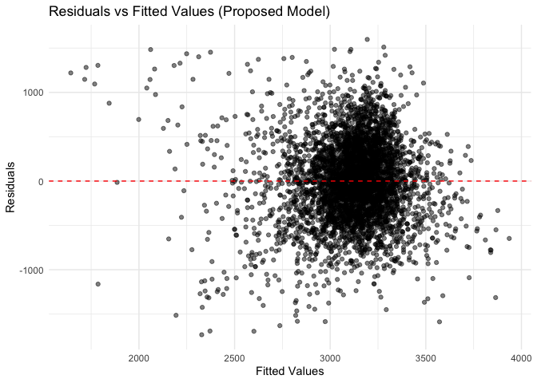
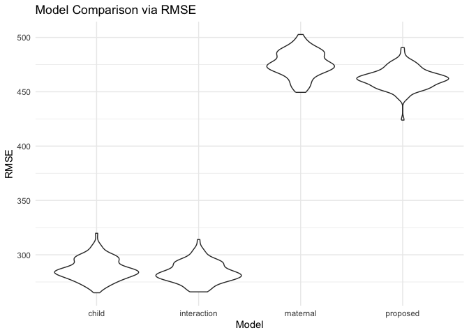
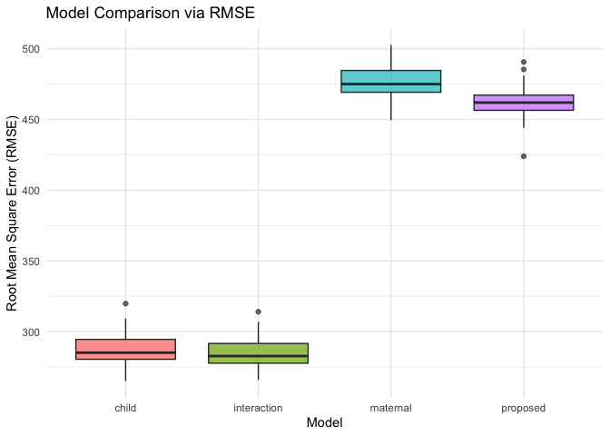

p8105_hw6_zl3544
================
2024-12-02

``` r
library(tidyverse)
```

    ## ── Attaching core tidyverse packages ──────────────────────── tidyverse 2.0.0 ──
    ## ✔ dplyr     1.1.4     ✔ readr     2.1.5
    ## ✔ forcats   1.0.0     ✔ stringr   1.5.1
    ## ✔ ggplot2   3.5.1     ✔ tibble    3.2.1
    ## ✔ lubridate 1.9.3     ✔ tidyr     1.3.1
    ## ✔ purrr     1.0.2     
    ## ── Conflicts ────────────────────────────────────────── tidyverse_conflicts() ──
    ## ✖ dplyr::filter() masks stats::filter()
    ## ✖ dplyr::lag()    masks stats::lag()
    ## ℹ Use the conflicted package (<http://conflicted.r-lib.org/>) to force all conflicts to become errors

``` r
library(purrr)
library(broom)
library(modelr)
```

    ## 
    ## Attaching package: 'modelr'
    ## 
    ## The following object is masked from 'package:broom':
    ## 
    ##     bootstrap

``` r
library(ggplot2)
library(janitor)
```

    ## 
    ## Attaching package: 'janitor'
    ## 
    ## The following objects are masked from 'package:stats':
    ## 
    ##     chisq.test, fisher.test

``` r
library(knitr)
library(forcats)
library(crossval)
```

# Problem 2

``` r
# Load and clean the data
homicides <- read_csv('./homicide-data.csv', na = c("Unknown", "NA", "", ".")) %>%
  janitor::clean_names() %>%
  mutate(
    city_state = paste(city, state, sep = ", "),
    resolved = if_else(disposition %in% c('Closed without arrest', 'Open/No arrest'), 0, 1),
    victim_age = as.numeric(victim_age)
  ) %>%
  filter(
    !city_state %in% c("Dallas, TX", "Phoenix, AZ", "Kansas City, MO", "Tulsa, AL"),
    victim_race %in% c("White", "Black")
  ) %>%
  drop_na(victim_age)
```

    ## Rows: 52179 Columns: 12
    ## ── Column specification ────────────────────────────────────────────────────────
    ## Delimiter: ","
    ## chr (8): uid, victim_last, victim_first, victim_race, victim_sex, city, stat...
    ## dbl (4): reported_date, victim_age, lat, lon
    ## 
    ## ℹ Use `spec()` to retrieve the full column specification for this data.
    ## ℹ Specify the column types or set `show_col_types = FALSE` to quiet this message.

``` r
# Logistic regression for Baltimore, MD
baltimore_data <- homicides %>%
  filter(city_state == "Baltimore, MD")

baltimore_model <- glm(
  resolved ~ victim_age + victim_sex + victim_race,
  data = baltimore_data,
  family = binomial
)

baltimore_results <- broom::tidy(baltimore_model, conf.int = TRUE, exponentiate = TRUE) %>%
  filter(term == "victim_sexMale") %>%
  select(estimate, conf.low, conf.high) %>%
  rename(
    OR = estimate,
    CI_lower = conf.low,
    CI_upper = conf.high
  )

# Print results for Baltimore
baltimore_results %>%
  kable(
    digits = 2,
    col.names = c("OR Estimate", "CI Lower", "CI Upper"),
    caption = "Baltimore Logistic Regression Results"
  )
```

| OR Estimate | CI Lower | CI Upper |
|------------:|---------:|---------:|
|        0.43 |     0.32 |     0.56 |

Baltimore Logistic Regression Results

``` r
# Logistic regression for all cities
city_results <- homicides %>%
  group_by(city_state) %>%
  nest() %>%
  mutate(
    model = map(data, ~ glm(resolved ~ victim_age + victim_sex + victim_race, data = ., family = binomial)),
    tidy_model = map(model, ~ broom::tidy(.x, conf.int = TRUE, exponentiate = TRUE))
  ) %>%
  unnest(tidy_model) %>%
  filter(term == "victim_sexMale") %>%
  mutate(
    OR = exp(estimate),
    CI_lower = exp(estimate - 1.96 * std.error),
    CI_upper = exp(estimate + 1.96 * std.error)
  ) %>%
  select(city_state, OR, CI_lower, CI_upper)

# Print all city results
city_results %>%
  kable(
    digits = 3,
    col.names = c("City, State", "OR Estimate", "CI Lower", "CI Upper"),
    caption = "City-Wide Logistic Regression Results"
  )
```

| City, State        | OR Estimate | CI Lower | CI Upper |
|:-------------------|------------:|---------:|---------:|
| Albuquerque, NM    |       5.856 |    2.752 |   12.461 |
| Atlanta, GA        |       2.718 |    1.858 |    3.977 |
| Baltimore, MD      |       1.530 |    1.167 |    2.006 |
| Baton Rouge, LA    |       1.464 |    0.803 |    2.669 |
| Birmingham, AL     |       2.387 |    1.576 |    3.616 |
| Boston, MA         |       1.949 |    1.032 |    3.679 |
| Buffalo, NY        |       1.683 |    0.937 |    3.023 |
| Charlotte, NC      |       2.420 |    1.525 |    3.841 |
| Chicago, IL        |       1.507 |    1.235 |    1.839 |
| Cincinnati, OH     |       1.492 |    0.881 |    2.526 |
| Columbus, OH       |       1.703 |    1.210 |    2.398 |
| Denver, CO         |       1.615 |    0.797 |    3.271 |
| Detroit, MI        |       1.790 |    1.421 |    2.256 |
| Durham, NC         |       2.253 |    1.087 |    4.669 |
| Fort Worth, TX     |       1.952 |    1.158 |    3.290 |
| Fresno, CA         |       3.801 |    1.652 |    8.742 |
| Houston, TX        |       2.036 |    1.597 |    2.596 |
| Indianapolis, IN   |       2.506 |    1.853 |    3.389 |
| Jacksonville, FL   |       2.054 |    1.531 |    2.756 |
| Las Vegas, NV      |       2.310 |    1.677 |    3.183 |
| Long Beach, CA     |       1.507 |    0.571 |    3.976 |
| Los Angeles, CA    |       1.938 |    1.342 |    2.801 |
| Louisville, KY     |       1.633 |    1.015 |    2.629 |
| Memphis, TN        |       2.061 |    1.508 |    2.817 |
| Miami, FL          |       1.674 |    0.989 |    2.833 |
| Milwaukee, wI      |       2.069 |    1.419 |    3.017 |
| Minneapolis, MN    |       2.578 |    1.302 |    5.104 |
| Nashville, TN      |       2.813 |    1.862 |    4.249 |
| New Orleans, LA    |       1.795 |    1.294 |    2.489 |
| New York, NY       |       1.300 |    0.683 |    2.473 |
| Oakland, CA        |       1.756 |    1.139 |    2.708 |
| Oklahoma City, OK  |       2.649 |    1.697 |    4.134 |
| Omaha, NE          |       1.466 |    0.778 |    2.762 |
| Philadelphia, PA   |       1.643 |    1.250 |    2.159 |
| Pittsburgh, PA     |       1.538 |    0.947 |    2.500 |
| Richmond, VA       |       2.735 |    1.354 |    5.525 |
| San Antonio, TX    |       2.023 |    1.142 |    3.585 |
| Sacramento, CA     |       1.952 |    0.977 |    3.901 |
| Savannah, GA       |       2.380 |    1.159 |    4.886 |
| San Bernardino, CA |       1.649 |    0.564 |    4.820 |
| San Diego, CA      |       1.511 |    0.730 |    3.129 |
| San Francisco, CA  |       1.836 |    0.957 |    3.521 |
| St. Louis, MO      |       2.020 |    1.524 |    2.678 |
| Stockton, CA       |       3.864 |    1.776 |    8.409 |
| Tampa, FL          |       2.243 |    0.966 |    5.209 |
| Tulsa, OK          |       2.653 |    1.668 |    4.219 |
| Washington, DC     |       1.996 |    1.355 |    2.941 |

City-Wide Logistic Regression Results

``` r
# Plot the results
city_results <- city_results %>%
  mutate(city_state = fct_reorder(city_state, OR))

ggplot(city_results, aes(x = OR, y = city_state)) +
  geom_point() +
  geom_errorbarh(
    aes(xmin = CI_lower, xmax = CI_upper), height = 0.33
  ) +
  labs(
    title = "Adjusted Odds Ratios for Solving Homicides (Male vs Female)",
    x = "Odds Ratio (Male vs Female Victims)",
    y = "City"
  ) +
  theme_minimal()
```

<!-- -->

## comment on the plot:

- Odds Ratios Above 1:

An odds ratio greater than 1 indicates that homicides involving male
victims are more likely to be solved compared to female victims.

Several cities, such as Washington, D.C., Tulsa, OK, and Tampa, FL,
exhibit ORs well above 1, suggesting a significantly higher likelihood
of solving male homicides.

- Wide Confidence Intervals:

Many cities have wide confidence intervals, such as Fort Worth, TX and
Albuquerque, NM. Wide intervals indicate higher variability in the data
or smaller sample sizes, reducing the reliability of these estimates.

- Cities with CIs Crossing 1:

For some cities, such as Charlotte, NC, the confidence intervals cross
1.

This suggests that the difference in solving rates between male and
female victims is not statistically significant in these cities.

- Extreme OR Values:

Some cities, like Fresno, CA, have extreme OR values with very large
confidence intervals, indicating unstable or unreliable estimates
potentially due to small sample sizes or data inconsistencies.

- conclusion:

On average, the plot suggests that male victims’ homicides are more
likely to be solved compared to female victims in most cities. However,
the wide confidence intervals and variability across cities highlight
the uncertainty and heterogeneity in these results.

# problem 3

## Proposed regression model

``` r
# Load and inspect the data
bwt_df <- read_csv("./birthweight.csv")
```

    ## Rows: 4342 Columns: 20
    ## ── Column specification ────────────────────────────────────────────────────────
    ## Delimiter: ","
    ## dbl (20): babysex, bhead, blength, bwt, delwt, fincome, frace, gaweeks, malf...
    ## 
    ## ℹ Use `spec()` to retrieve the full column specification for this data.
    ## ℹ Specify the column types or set `show_col_types = FALSE` to quiet this message.

``` r
# Clean the data
bwt_df <- bwt_df |>
  mutate(
    babysex = factor(babysex, levels = c(1, 2), labels = c("Male", "Female")),
    frace = factor(frace),
    mrace = factor(mrace),
    malform = factor(malform),
    smoken = as.numeric(smoken)
  ) |>
  drop_na()  
summary(bwt_df)
```

    ##    babysex         bhead          blength           bwt           delwt      
    ##  Male  :2230   Min.   :21.00   Min.   :20.00   Min.   : 595   Min.   : 86.0  
    ##  Female:2112   1st Qu.:33.00   1st Qu.:48.00   1st Qu.:2807   1st Qu.:131.0  
    ##                Median :34.00   Median :50.00   Median :3132   Median :143.0  
    ##                Mean   :33.65   Mean   :49.75   Mean   :3114   Mean   :145.6  
    ##                3rd Qu.:35.00   3rd Qu.:51.00   3rd Qu.:3459   3rd Qu.:157.0  
    ##                Max.   :41.00   Max.   :63.00   Max.   :4791   Max.   :334.0  
    ##     fincome      frace       gaweeks      malform     menarche    
    ##  Min.   : 0.00   1:2123   Min.   :17.70   0:4327   Min.   : 0.00  
    ##  1st Qu.:25.00   2:1911   1st Qu.:38.30   1:  15   1st Qu.:12.00  
    ##  Median :35.00   3:  46   Median :39.90            Median :12.00  
    ##  Mean   :44.11   4: 248   Mean   :39.43            Mean   :12.51  
    ##  3rd Qu.:65.00   8:  14   3rd Qu.:41.10            3rd Qu.:13.00  
    ##  Max.   :96.00            Max.   :51.30            Max.   :19.00  
    ##     mheight          momage     mrace        parity            pnumlbw 
    ##  Min.   :48.00   Min.   :12.0   1:2147   Min.   :0.000000   Min.   :0  
    ##  1st Qu.:62.00   1st Qu.:18.0   2:1909   1st Qu.:0.000000   1st Qu.:0  
    ##  Median :63.00   Median :20.0   3:  43   Median :0.000000   Median :0  
    ##  Mean   :63.49   Mean   :20.3   4: 243   Mean   :0.002303   Mean   :0  
    ##  3rd Qu.:65.00   3rd Qu.:22.0            3rd Qu.:0.000000   3rd Qu.:0  
    ##  Max.   :77.00   Max.   :44.0            Max.   :6.000000   Max.   :0  
    ##     pnumsga      ppbmi            ppwt           smoken           wtgain      
    ##  Min.   :0   Min.   :13.07   Min.   : 70.0   Min.   : 0.000   Min.   :-46.00  
    ##  1st Qu.:0   1st Qu.:19.53   1st Qu.:110.0   1st Qu.: 0.000   1st Qu.: 15.00  
    ##  Median :0   Median :21.03   Median :120.0   Median : 0.000   Median : 22.00  
    ##  Mean   :0   Mean   :21.57   Mean   :123.5   Mean   : 4.145   Mean   : 22.08  
    ##  3rd Qu.:0   3rd Qu.:22.91   3rd Qu.:134.0   3rd Qu.: 5.000   3rd Qu.: 28.00  
    ##  Max.   :0   Max.   :46.10   Max.   :287.0   Max.   :60.000   Max.   : 89.00

``` r
# Proposed model based on hypothesized relationships
bwt_model1 <- lm(
  bwt ~ gaweeks + ppbmi + smoken + parity + malform + pnumlbw,
  data = bwt_df
)

# Summarize the proposed model
bwt_model1 |>
  broom::tidy()
```

    ## # A tibble: 7 × 5
    ##   term        estimate std.error statistic    p.value
    ##   <chr>          <dbl>     <dbl>     <dbl>      <dbl>
    ## 1 (Intercept)   193.      99.2       1.94   5.20e-  2
    ## 2 gaweeks        67.4      2.23     30.2    1.08e-181
    ## 3 ppbmi          13.4      2.21      6.08   1.29e-  9
    ## 4 smoken         -6.31     0.949    -6.66   3.17e- 11
    ## 5 parity        123.      68.4       1.80   7.25e-  2
    ## 6 malform1       56.6    120.        0.473  6.36e-  1
    ## 7 pnumlbw        NA       NA        NA     NA

``` r
# Add predictions and residuals for diagnostic plot
bwt_df <- bwt_df |>
  add_predictions(bwt_model1, var = "fitted") |>
  add_residuals(bwt_model1, var = "residuals")

# Residuals vs Fitted Values Plot
ggplot(bwt_df, aes(x = fitted, y = residuals)) +
  geom_point(alpha = 0.5) +
  geom_hline(yintercept = 0, color = "red", linetype = "dashed") +
  labs(
    title = "Residuals vs Fitted Values (Proposed Model)",
    x = "Fitted Values",
    y = "Residuals"
  ) +
  theme_minimal()
```

<!-- -->

## different models

``` r
# alternative model 1
model_maternal <- lm(
  bwt ~ momage + ppbmi + ppwt + smoken + wtgain,
  data = bwt_df
)
model_maternal |>
  broom::tidy()
```

    ## # A tibble: 6 × 5
    ##   term        estimate std.error statistic   p.value
    ##   <chr>          <dbl>     <dbl>     <dbl>     <dbl>
    ## 1 (Intercept)  2046.      64.2       31.9  1.43e-200
    ## 2 momage         18.2      1.89       9.61 1.16e- 21
    ## 3 ppbmi         -28.7      4.38      -6.55 6.27e- 11
    ## 4 ppwt            8.67     0.693     12.5  2.48e- 35
    ## 5 smoken         -7.28     0.979     -7.43 1.26e- 13
    ## 6 wtgain         12.6      0.667     18.8  4.49e- 76

``` r
# alternative model 2
model_child <- lm(
  bwt ~ gaweeks + bhead + blength + babysex,
  data = bwt_df
)
model_child |>
  broom::tidy()
```

    ## # A tibble: 5 × 5
    ##   term          estimate std.error statistic   p.value
    ##   <chr>            <dbl>     <dbl>     <dbl>     <dbl>
    ## 1 (Intercept)    -6264.      97.9     -64.0  0        
    ## 2 gaweeks           14.1      1.51      9.30 2.23e- 20
    ## 3 bhead            141.       3.57     39.5  7.32e-292
    ## 4 blength           81.8      2.08     39.3  4.44e-289
    ## 5 babysexFemale     33.4      8.84      3.78 1.58e-  4

``` r
# alternative model 3
model_interaction <- lm(
  bwt ~ gaweeks * ppbmi + smoken * blength + wtgain * bhead,
  data = bwt_df
)
model_interaction |>
  broom::tidy()
```

    ## # A tibble: 10 × 5
    ##    term            estimate std.error statistic   p.value
    ##    <chr>              <dbl>     <dbl>     <dbl>     <dbl>
    ##  1 (Intercept)    -5870.      415.      -14.1   2.06e- 44
    ##  2 gaweeks           19.9       9.58      2.07  3.82e-  2
    ##  3 ppbmi             15.3      17.5       0.877 3.80e-  1
    ##  4 smoken           -39.1      11.0      -3.57  3.59e-  4
    ##  5 blength           77.0       2.23     34.6   1.10e-231
    ##  6 wtgain           -14.1       7.42     -1.90  5.79e-  2
    ##  7 bhead            124.        5.72     21.7   1.82e- 99
    ##  8 gaweeks:ppbmi     -0.258     0.439    -0.586 5.58e-  1
    ##  9 smoken:blength     0.749     0.221     3.39  7.15e-  4
    ## 10 wtgain:bhead       0.527     0.219     2.40  1.64e-  2

``` r
# Define a function to calculate RMSE
rmse <- function(model, data) {
  sqrt(mean((data$bwt - predict(model, newdata = data))^2))
}

# Monte Carlo cross-validation
set.seed(12)
cv_df <- crossv_mc(bwt_df, 100) |>
  mutate(
    train = map(train, as_tibble),
    test = map(test, as_tibble)
  )
```

## cross-validation

``` r
# Fit models for cross-validation
cv_res_df <- cv_df |>
  mutate(
    proposed_mod = map(train, ~ lm(bwt ~ gaweeks + ppbmi + smoken + parity + malform + pnumlbw, data = .)),
    maternal_mod = map(train, ~ lm(bwt ~ momage + ppbmi + ppwt + smoken + wtgain, data = .)),
    child_mod = map(train, ~ lm(bwt ~ gaweeks + bhead + blength + babysex, data = .)),
    interaction_mod = map(train, ~ lm(bwt ~ gaweeks * ppbmi + smoken * blength + wtgain * bhead, data = .))
  ) |>
  mutate(
    rmse_proposed = map2_dbl(proposed_mod, test, rmse),
    rmse_maternal = map2_dbl(maternal_mod, test, rmse),
    rmse_child = map2_dbl(child_mod, test, rmse),
    rmse_interaction = map2_dbl(interaction_mod, test, rmse)
  )
```

    ## Warning: There was 1 warning in `mutate()`.
    ## ℹ In argument: `rmse_proposed = map2_dbl(proposed_mod, test, rmse)`.
    ## Caused by warning in `predict.lm()`:
    ## ! prediction from rank-deficient fit; attr(*, "non-estim") has doubtful cases

``` r
# Summarize cross-validation results
cv_summary <- cv_res_df |>
  select(starts_with("rmse")) |>
  pivot_longer(
    everything(),
    names_to = "model",
    values_to = "rmse",
    names_prefix = "rmse_"
  )

# Violin plot for RMSE distribution
ggplot(cv_summary, aes(x = model, y = rmse)) +
  geom_violin() +
  labs(
    title = "Model Comparison via RMSE",
    x = "Model",
    y = "RMSE"
  ) +
  theme_minimal()
```

<!-- -->

``` r
# Boxplot for RMSE comparison
ggplot(cv_summary, aes(x = model, y = rmse, fill = model)) +
  geom_boxplot(alpha = 0.7) +
  labs(
    title = "Model Comparison via RMSE",
    x = "Model",
    y = "Root Mean Square Error (RMSE)"
  ) +
  theme_minimal() +
  theme(legend.position = "none")
```

<!-- --> One
using head circumference, length, sex, and all interactions (including
the three-way interaction) between these is the best model considering
the RMSE.
